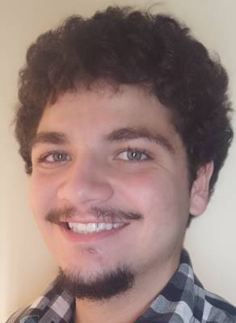

  

  

    <h1 style="margin-bottom: 0.2em;">Julio Barros</h1>
    
<em>Physicist — data science, material science, modeling, and visualization</em>

  

I’m a physicist and data scientist working on micromechanics, modeling, and quantitative analysis of materials.  
I enjoy exploring the intersection between experimental data and computational methods — especially in biomaterials and wood mechanics.

📍 Based in Switzerland · Originally from Brazil 🇧🇷

  <a href="cv.pdf">📄 Download CV</a> |
  <a href="https://github.com/juliobarros">💼 GitHub</a> |
  <a href="https://www.linkedin.com/in/julio-o-amando-de-barros-a80861129/">🔗 LinkedIn</a> |
  <a href="https://scholar.google.com/citations?user=0siqWoIAAAAJ&hl=en&oi=ao">🎓 Google Scholar</a> |
  <a href="personal.md">🌿 Personal Life</a>

---

### 💬 About this site
This page collects my work, research, and side projects.  
For more personal interests, check out [my personal life page](personal.md).
